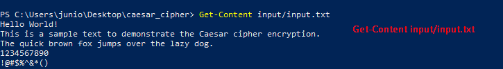
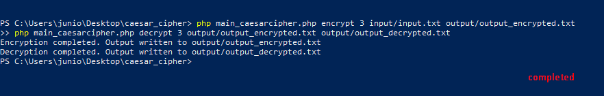
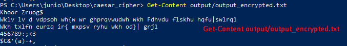
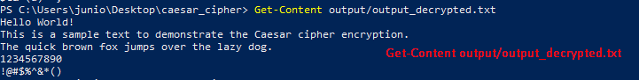

# Caesar Cipher Tutorial and Testing Guide

```markdown
# Caesar Cipher Tutorial and Testing Guide

## Prerequisites
* PHP installed on your system
* Access to command line/terminal
* Repository files downloaded locally

## Step 1: Verify Input Text
Check input/input.txt contains:
```
Hello World! This is a sample text to demonstrate the Caesar cipher encryption. The quick brown fox jumps over the lazy dog. 1234567890 !@#$%^&*()
```

## Step 2: Run the Script
```bash
# Navigate to the project directory
cd caesar-cipher

# Run the PHP script
php main_caesarcipher.php
```

## Step 3: Verify Encryption
Check output/output_encrypted.txt for the encrypted text. The encryption should:
* Shift each letter by the specified amount
* Maintain case sensitivity
* Preserve special characters and numbers

## Step 4: Verify Decryption
Check output/output_decrypted.txt. This file should:
* Contain text identical to the input
* Match the original formatting
* Have preserved all special characters

## View Input and Output Files
1. Check Input File Content:
```powershell
Get-Content input/input.txt
```

2. Check Encrypted File Content:
```powershell
Get-Content output/output_encrypted.txt
```

3. Check Decrypted File Content:
```powershell
Get-Content output/output_decrypted.txt
```

## Example Output
Original text: "Hello World!"
Encrypted (shift by 3): "Khoor Zruog!"
Decrypted: "Hello World!"

## Screenshots
### Input File


### Running the Script


### Encrypted Output


### Decrypted Output 


## Troubleshooting
* Ensure PHP is properly installed
* Check file permissions
* Verify input/output directory structure
* Confirm proper file encoding (UTF-8)

## Documentation
Each step in the process creates specific files:
```
input/
  └── input.txt           (Original text)
output/
  ├── output_encrypted.txt (Encrypted result)
  └── output_decrypted.txt (Decrypted result)
```

## Validation Checklist
- [✅] Input file contains test text
- [✅] Script runs without errors
- [✅] Encrypted file is created
- [✅] Decrypted file matches input
- [✅] Special characters are preserved
- [✅] All screenshots are clear and properly referenced

## Security Notice
✅ This code is provided for educational purposes. Always scan downloaded files before running them:
1. Visit [VirusTotal](https://www.virustotal.com/gui/home/upload)
2. Upload the files
3. Review the security analysis
```
